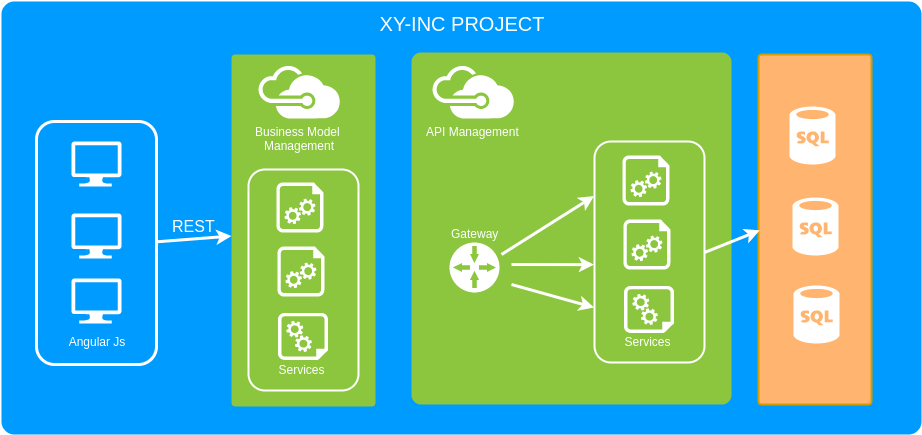
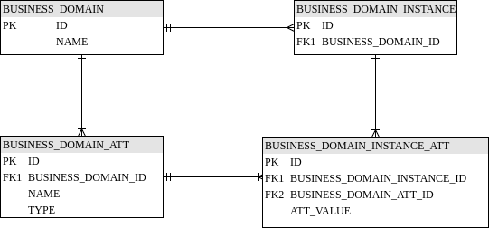

# Documento de Arquitetura do Projeto

 ## Overview
 
Este é um overview da arquitetura do projeto xy-inc versão 1.0-SNAPSHOT. O xy-inc 
possui como objetivo fornecer uma interface web simples para cadastro e listagem de 
modelos de domínio com nome e atributos. Após a criação, o sistema deve fornecer uma
API REST que permita à um usuário realizar o gerenciamento de recursos através de 
serviços.

A versão inicial é um MVP, ou seja, possui as funcionalidades básicas com o objetivo
de iniciar o uso do sistema e aperfeiçoar as funcionalidades visando a melhoria do
 produto. Para executar a aplicação não é necessária a instalação de softwares complementares
 ao maven, uma vez que são utilizados componentes incorporados ao framework Spring Boot.
 
 

 #### Back-end

Existem 2 APIs desenvolvidas com um conjunto de serviços. A primeira é a API responsável por
realizar a criação, deleção e consulta dos modelos de domínio cadastrados pelos usuários. Essa API
é utilizada pela interface web disponibilizada.

```
http://localhost:8080/businessdomain/ GET Retorna a lista de modelos cadastrados
http://localhost:8080/businessdomain/ POST Cria um modelo de domínio
http://localhost:8080/businessdomain/<id> DELETE Deleta um modelos cadastrado por ID
```

A segunda API permite o gerenciamento da API REST disponibilizada para cada modelo de domínio
cadastrado pelo usuário. Cada modelo de domínio será considerado como um recurso e irá possuir 
serviços para criação, update, deleção e consulta.

```
http://localhost:8080/api/<nome_modelo> GET Retorna a lista de instâncias deste modelo cadastrado
http://localhost:8080/api/<nome_modelo>/<id> GET Retorna a instância deste modelo cadastrado por ID
http://localhost:8080/api/<nome_modelo> POST Cria uma instância deste modelo de domínio
http://localhost:8080/api/<nome_modelo>/<id> DELETE Deleta uma instância do modelos cadastrado por ID
http://localhost:8080/api/<nome_modelo> PUT Edita uma instância deste modelo de domínio
```

Ambas as APIs são REST, Stateless e permitem requisições Json para retorno dos dados. A estrutura montada
foi criada de forma genérica o suficiente para permite que independente da quantidade de modelos 
que sejam criados, a forma de requisição será feita da mesma forma. 

Foi utilizado como base o framework Spring Boot para o desenvolvimento do sistema.
Nessa versão do sistema foi utilizada a versão do servidor de aplicação Tomcat incorporada. 
Além disso, foi utilizado o banco de dados H2, também incorporado. Como o Spring Boot é bem
 componentizado. A substituição do servidor de aplicação atual e o banco de dados por um mais 
 robusto, somente vão necessitar de algumas configurações básicas nos arquivos de inicialização e
 configurações da aplicação.
 
 O framework possui componentes que permitem a fácil integração de estruturas de cache ou banco de dados
 mais robustos, pois possui uma gama de componentes que permitem esse suporte. A utilização dessas estruturas
  permitem diminuir o tempo de consulta. Além disso, a estrutura atual permite a execução da aplicação
  tanto em ambiente de nuvem como em servidores locais, uma vez que não necessita de nenhuma configuração
  particular de ambiente (com exceção dos requisitos já apresentados).
 
 Estão sendo utilizados os frameworks JUnit e MockMVC para a realização dos testes de software visando 
 garantir a confiabilidade e consistência do sistema. A cobertura dos testes foi avaliada utilizando
  a ferramenta de cobertura incorporada a IDE IntelliJ.
 
 ##### Modelo de Banco de Dados
 
  
 
 #### Front-end
 
O front-end do sistema foi desenvolvido utilizando o framework javascript angular MVC e
a biblioteca bootstrap. Essas tecnologias em conjunto trazaem agilidade no desenvolvimento
e tornam mais fácil a manutenção, uma vez que o código fica mais limpo e fácil de
utilizar.

 